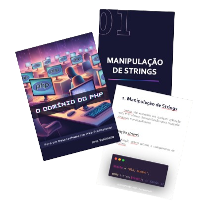

# Projeto E-book Gerado por I.A.s

    

> Este repositório contém um E-book criado como parte do curso da Digital Innovation One (DIO).

## 🔗 Link do Projeto

[Clique aqui começar a leitura 📚](https://github.com/AnaYukimoto/Ebook-DIO/blob/main/output/Ebook_IA.pdf) 

## 💻 Tecnologias Utilizadas no Projeto

- [ChatGPT](https://chat.openai.com/) 
- [MidJourney](https://www.midjourney.com/app/)
- [PowerPoint](https://www.microsoft.com/en/microsoft-365/powerpoint)
